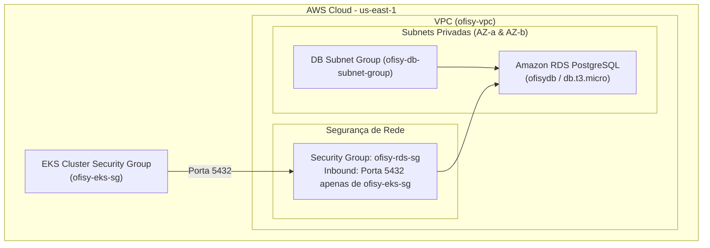

# 🗄️ Ofisy - Infraestrutura do Banco de Dados Gerenciado (RDS PostgreSQL)

Este repositório é responsável pelo provisionamento automatizado via **Terraform** da infraestrutura do banco de dados relacional gerenciado **Amazon RDS PostgreSQL** para a plataforma **Ofisy**, conforme os requisitos do **Tech Challenge (Fase 3 - SOAT / FIAP)**.

---

## 🎯 Propósito do Repositório

Garantir o isolamento, alta disponibilidade, segurança e gerenciamento do ciclo de vida do banco de dados PostgreSQL na AWS. O banco de dados é provisionado em subnets privadas dentro da VPC da aplicação e configurado com regras restritas de acesso via Security Groups.

---

## 📁 Estrutura do Repositório

```
techchallenge-ofisy-rds-infra/
├── .github/
│   └── workflows/
│       └── deploy-rds.yml      # Pipeline CI/CD no GitHub Actions
├── infra/
│   ├── main.tf                 # Configuração do provedor AWS e locals
│   ├── variables.tf            # Variáveis de entrada (db_password, account_id, etc.)
│   ├── data.tf                 # Busca dinâmica de VPC, Subnets e SG do EKS
│   ├── rds.tf                  # Instância RDS PostgreSQL e DB Subnet Group
│   ├── security_groups.tf      # Security Group do RDS e regras de tráfego
│   ├── outputs.tf              # Endpoints e saídas do banco de dados
│   ├── backend.tf              # Backend remoto no S3
│   ├── backend.hcl.example     # Exemplo de configuração do backend S3
│   └── terraform.tfvars.example# Exemplo de arquivo de variáveis
└── README.md                   # Documentação oficial do repositório
```

---

## 🛠️ Tecnologias Utilizadas

* **[Terraform](https://www.terraform.io/)** (>= 1.5.0): Infraestrutura como Código (IaC).
* **[Amazon RDS (Relational Database Service)](https://aws.amazon.com/rds/)**: Instância gerenciada do PostgreSQL 15.
* **[Amazon VPC](https://aws.amazon.com/vpc/)**: Subnet Groups e isolamento de rede privada.
* **[GitHub Actions](https://github.com/features/actions)**: Pipeline automatizada de CI/CD para plan e apply da infraestrutura.

---

## 🏗️ Arquitetura do Banco de Dados



---

## 🚀 Passos para Execução e Deploy

### 1. Pré-requisitos Locais
* **Terraform CLI** (versão 1.5.0 ou superior)
* **AWS CLI** configurada com credenciais com permissão para gerenciar instâncias RDS e VPC.

### 2. Configuração do Backend e Variáveis
Acesse o diretório `infra/`:
```bash
cd infra
```

Crie o arquivo `infra/backend.hcl` para o Remote State do S3:
```hcl
bucket = "ofisy-tfstate-<SEU_AWS_ACCOUNT_ID>"
key    = "rds/terraform.tfstate"
region = "us-east-1"
```

Crie o arquivo `infra/terraform.tfvars`:
```hcl
account_id  = "<SEU_AWS_ACCOUNT_ID>"
db_password = "<SUA_SENHA_DO_BANCO_RDS>"
```

### 3. Execução dos Comandos Terraform
```bash
# Inicializa os provedores e o backend remoto
terraform init -backend-config=backend.hcl

# Visualiza o plano de execução
terraform plan

# Aplica as alterações e cria o RDS
terraform apply -auto-approve
```

---

## 🔄 Pipeline CI/CD (GitHub Actions)

A pipeline é executada automaticamente em qualquer `push` ou `pull_request` nas branches `main`/`master`.

### Secrets Necessárias no GitHub Repository:
* `AWS_ACCESS_KEY_ID`: Chave de acesso AWS.
* `AWS_SECRET_ACCESS_KEY`: Chave secreta AWS.
* `AWS_SESSION_TOKEN`: Token de sessão (para AWS Academy / SSO).
* `AWS_ACCOUNT_ID`: ID numérico da conta AWS.
* `DB_PASSWORD`: Senha master do PostgreSQL (mínimo 8 caracteres).

---

## 🔗 Repositórios Relacionados & Documentação

* 🟢 **Aplicação Principal (Kubernetes):** [techchallenge-ofisy](https://github.com/15SOAT-FIAP/techchallenge-ofisy)
* 🔐 **Lambda Serverless Auth:** [techchallenge-ofisy-auth-lambda](https://github.com/15SOAT-FIAP/techchallenge-ofisy-auth-lambda)
* ☁️ **Infraestrutura Kubernetes (EKS):** [techchallenge-ofisy-eks-infra](https://github.com/15SOAT-FIAP/techchallenge-ofisy-eks-infra)
* 📖 **Documentação Swagger/Postman:** Disponível no endpoint da Aplicação Principal (`/swagger-ui/index.html`).
